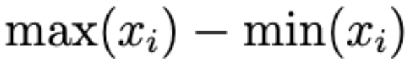

```{r include=FALSE}
packages <- c("chromote", "pdftools", "xaringanExtra", "haven", "readr", "dplyr", "knitr", "withr", "htmltools")

for (package in packages) {
  if (!require(package, character.only = TRUE)) {
    install.packages(package)
    library(package, character.only = TRUE)
  }
}

xaringanExtra::use_tile_view()
xaringanExtra::use_share_again()
xaringanExtra::use_broadcast()
xaringanExtra::use_scribble(pen_color = "#a4c4f4", pen_size = 8, eraser_size = 30)
xaringanExtra::use_fit_screen()
```
class: center, middle

# **What is Statistics?**

### "A branch of mathematics dealing with the collection, analysis, interpretation, and presentation of masses of numerical data."

---
class: middle
# What does this mean today?
- Descriptive Statistics
- Hypothesis Testing
- Big Data
- Data Cleaning
- Data Processing
- Supervised/Unsupervised Learned

---
class: center, middle, full-background
background-image: url('./media/handtouch.png')

---
class: center, middle,
##Definition
#Summation


####where <i>i</i> is the index of summation; <i>a<sub>i</sub></i> is an indexed variable representing each term of the sum; <i>m</i> is the lower bound of summation, and <i>n</i> is the upper bound of summation. The "<i>i = m</i>" under the summation symbol means that the index <i>i</i> starts out equal to <i>m</i>. The index, <i>i</i>, is incremented by one for each successive term, stopping when <i>i = n</i>.


---
##Example
#Summation

####The summation of $i$ from $i = 1$ to $3$ is:

$$
\sum_{i=1}^{3} i
$$

####The summation of $i^2$ from $i = 3$ to $6$ is:

$$
\sum_{i=3}^{6} i^2
$$

####The summation of $\frac{1}{2^n}$ from $i = 0$ to $\infty$ is:

$$
\sum_{i=0}^{\infty} \frac{1}{2^n}
$$

---
##Example
#Summation

####The summation of $i$ from $i = 1$ to $3$ is:

$$
\sum_{i=1}^{3} i = 1 + 2 + 3 = 6
$$

####The summation of $i^2$ from $i = 3$ to $6$ is:

$$
\sum_{i=3}^{6} i^2 = 3^2 + 4^2 + 5^2 + 6^2 = 86
$$

####The summation of $\frac{1}{2^n}$ from $i = 0$ to $\infty$ is:

$$
\sum_{i=0}^{\infty} \frac{1}{2^n} = \frac{1}{1} + \frac{1}{2} + \frac{1}{4} + ... = 2 \quad\text{(Convergent series!)}
$$

---
class: center, middle,
##Definition
#Arithmetic Mean (Average)


#### where <i>n</i> is the number of observations for a given sample; <i>x<sub>i</sub></i> is an indexed variable representing each observation of a total of <i>n</i> observations; <i>x&#773;</i> is the symbol most often used for average though in practice this can be used for other purposes.

---
##Example
#Arithmetic Mean (Average)

#### Find the mean of the following set of numbers: 2, 4, 6, 8, 10.

$$
\frac{1}{5}\sum_{i=1}^{5} x_i = \frac{2 + 4 + 6 + 8 + 10}{5}
$$

#### Find the weighted mean of the following set of numbers: 80, 85, 90, and 95 with respective weights of 1, 2, 3, and 4.

<p style="text-align: center;"></p>

#### Find the mean from a frequency distribution of the following set of numbers: 2, 3, 5, 7. with respective frequencies of 3, 5, 2, 4.

<p style="text-align: center;"></p>

---
##Example
#Arithmetic Mean (Average)

#### Find the mean of the following set of numbers: 2, 4, 6, 8, 10.

$$
\frac{1}{5}\sum_{i=1}^{5} x_i = \frac{2 + 4 + 6 + 8 + 10}{5} = \frac{30}{5} = 6
$$

#### Find the weighted mean of the following set of numbers: 80, 85, 90, and 95 with respective weights of 1, 2, 3, and 4.

<p style="text-align: center;"></p>

#### Find the mean from a frequency distribution of the following set of numbers: 2, 3, 5, 7 with respective frequencies of 3, 5, 2, 4.

<p style="text-align: center;"></p>

---
class: center, middle,
##Definition
#Median

<p style="text-align: center;"></p>

#### where <em>n</em> is the number of observations in a sorted dataset; <em>x<sub>i</sub></em> is the <em>i<sup>th</sup></em> observation in the dataset such that for an odd number of observations, the median is the middle value, and for an even number of observations, the median is the average of the two middle values.

---
##Example
#Median

#### Find the median of the following set of numbers: 3, 1, 4.

<p style="text-align: center;"></p>

#### Find the median of the following set of numbers: 5, 3, 8, 7.

<p style="text-align: center;"></p>

#### Find the median from a frequency distribution of the following set of numbers: 2, 4, 6 with respective frequencies of 2, 3, 4.

<p style="text-align: center;"></p>

---
##Example
#Median

#### Find the median of the following set of numbers: 3, 1, 4.

<p style="text-align: center;"></p>

#### Find the median of the following set of numbers: 5, 3, 8, 7.

<p style="text-align: center;"></p>

#### Find the median from a frequency distribution of the following set of numbers: 2, 4, 6 with respective frequencies of 2, 3, 4.

<p style="text-align: center;"></p>

---
class: center, middle,
##Definition
#Mode

<p style="text-align: center;"></p>

#### where <em>x</em> is a value in the dataset, <em>x<sub>i</sub></em> represents each distinct value in the dataset, and <em>n</em> is the number of distinct values; the mode is the value of <em>x</em> for which the sum of the indicator function is maximized such that the most frequently occurring value in the dataset is identified

---
##Example
#Mode

#### Find the mode of the following set of numbers: 2, 2, 3, 4, 4, 4, 5.

<p style="text-align: center;"></p>

#### Find the mode of the following set of numbers: 1, 1, 2, 3, 3, 3, 4, 4, 4, 5.

<p style="text-align: center;"></p>

#### Find the mode from a frequency distribution of the following set of numbers: 1, 2, 3, 4 with respective frequencies of 4, 2, 5, 5.

<p style="text-align: center;"></p>

---
##Example
#Mode

#### Find the mode of the following set of numbers: 2, 2, 3, 4, 4, 4, 5.

<em>In this dataset, the indicator function would have the highest sum for the number 4, such that the mode of the dataset is 4.</em>

#### Find the mode of the following set of numbers: 1, 1, 2, 3, 3, 3, 4, 4, 4, 5.

<em>In this dataset, the indicator function would have the highest sum for the numbers 3 and 4, such that the dataset is bimodal with modes 3 and 4.</em>

#### Find the mode from a frequency distribution of the following set of numbers: 1, 2, 3, 4 with respective frequencies of 4, 2, 5, 5.

<em>In this distribution, the indicator function will be maximized for the values 3 and 4, such that the dataset is bimodal with modes 3 and 4.</em>

---
class: center, middle
##Definition
#Range

<p style="text-align: center;"></p>

#### where <em>x<sub>i</sub></em> represents individual observations in a data set, and the range is a measure of the spread or dispersion of the values in the data set, calculated as the difference between the maximum and minimum observed values

---
##Example
#Range

#### Find the range of the following set of numbers: 5, 8, 3, 12.
$$
\text{max}(x_i) - \text{min}(x_i) = 12 - 3
$$

#### Find the range of the following set of numbers: -7, -3, 2, 5, 10.

$$
\text{max}(x_i) - \text{min}(x_i) = 10 - (-7)
$$

#### Find the range from a frequency distribution of the following set of numbers: 2, 4, 6, 9 with respective frequencies of 0, 3, 2, 1.


$$
\text{max}(x_i) - \text{min}(x_i) = 9 - 4
$$

---
##Example
#Range

#### Find the range of the following set of numbers: 5, 8, 3, 12.
$$
\text{max}(x_i) - \text{min}(x_i) = 12 - 3 = 9
$$

#### Find the range of the following set of numbers: -7, -3, 2, 5, 10.

$$
\text{max}(x_i) - \text{min}(x_i) = 10 - (-7) = 17
$$

#### Find the range from a frequency distribution of the following set of numbers: 2, 4, 6, 9 with respective frequencies of 0, 3, 2, 1.


$$
\text{max}(x_i) - \text{min}(x_i) = 9 - 4 = 5
$$

---
class: middle
### **When to use average vs. median?**

<p style="text-align: center;"></p>

---
class: middle
### **What about now?**

<p style="text-align: center;"></p>

---
class: center, middle
##Definition
#Normal Distribution

<p style="text-align: center;"></p>

#### where <em>x</em> represents a variable, <em>μ</em> is the mean of the distribution, <em>σ</em> is the standard deviation, <em>σ<sup>2</sup></em> is the variance, and <em>e</em> is Euler's number, the base of the natural logarithms. The normal distribution is symmetrical, with a bell-shaped curve where the majority of observations cluster around the mean, and probabilities for <em>x</em> taper off symmetrically in both directions from the mean

---
### **Are there other distributions?**

---
### **Are there other distributions?**
- Poisson Distribution
- Heavy-Tailed Distribution
- Tukey's Lambda Distribution
- Exponential Distribution
- Uniform Distribution
- Binomial Distribution
- Geometric Distribution
- Beta Distribution

####Each distribution has its own unique properties and applications, ranging from modeling the number of events occurring in a fixed interval of time or space (Poisson Distribution), to describing outcomes with only two possible values (Binomial Distribution), to modeling waiting times (Exponential Distribution), ...

---
class: center, middle
### **What tools exist to help with data cleaning, modeling, and analysis?**

<table style="width:100%; margin-top: 20px;">
  <tr>
    <td style="width:50%;"><br><strong style="font-size: larger;">R</strong></td>
    <td style="width:50%;"><br><strong font-size: larger;>Python</strong></td>
  </tr>
</table>

####and other point and click software like Jamovi and SPSS for those who would prefer as little programming as possible. Note that there are many other languages available for data analysis other than R and Python though today these are the two most often used languages for this purpose.

---
### **How can I learn to code with open-source?**
<p>With <em>open source</em> through GitHub, you can host and review code, manage projects, and build software alongside 50 million developers.</p>

<p><strong>Pros of Open Source for Learning:</strong></p>
- <strong>Collaboration:</strong> Engage with a community of learners and developers.
- <strong>Transparency:</strong> Access the source code and understand the inner workings.
- <strong>Diversity of Projects:</strong> Contribute to projects that range from beginner-friendly to advanced.
- <strong>Real-World Experience:</strong> Work on projects that are used in the real world.
- <strong>Resources and Tools:</strong> Utilize a plethora of free tools and resources available for learning.

---
class: center, middle
#StatQuest
<h3 align="center"><a href="https://www.youtube.com/watch?v=SzZ6GpcfoQY&ab_channel=StatQuestwithJoshStarmer">Calculating the Mean, Variance and Standard Deviation, Clearly Explained!!!</a></h3>

---
class: center, middle
# **Questions?**