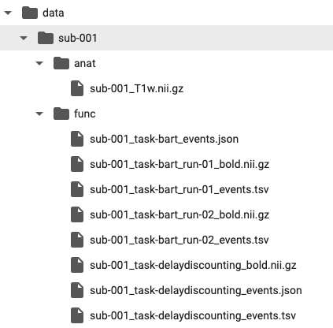
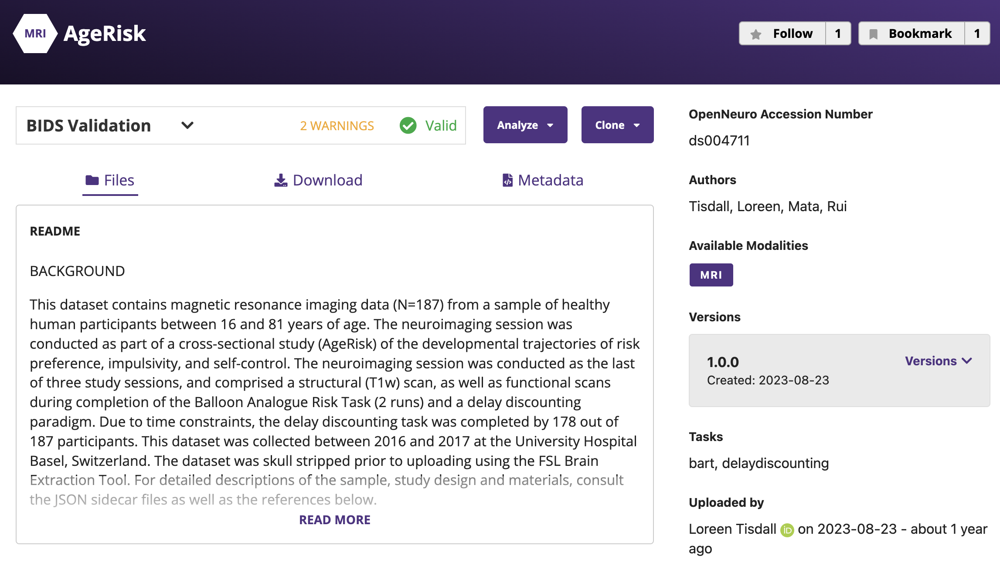

```{r include=FALSE}
packages <- c("chromote", "pdftools", "xaringanExtra", "haven", "readr", "dplyr", "knitr", "withr", "htmltools", "reticulate", "xaringan", "kableExtra")

for (package in packages) {
  if (!require(package, character.only = TRUE)) {
    install.packages(package)
    library(package, character.only = TRUE)
  }
}

xaringanExtra::use_tile_view()
xaringanExtra::use_share_again()
xaringanExtra::use_broadcast()
xaringanExtra::use_scribble(pen_color = "#a4c4f4", pen_size = 8, eraser_size = 30)
xaringanExtra::use_fit_screen()
```

class: center, middle

# **What is  ?**

### An open platform for sharing and analyzing neuroimaging data, enabling reproducible neuroscience research.

##### **Designed to facilitate the open sharing of datasets, OpenNeuro supports a variety of neuroimaging data formats, including MRI, fMRI, MEG, and EEG.*

---
class: middle

# Why OpenNeuro?
- **Large, Diverse datasets:** MRI, fMRI, MEG, EEG
- **Standardized:** BIDS format for easy integration.
- **Integration:** Works seamlessly with Python and can be downloaded directly.
- **Reproducibility:** Open access ensures ease of research validation.

---
class: middle

# Datasets
- Originally launched as **OpenfMRI** in 2010, focusing on fMRI datasets.
- Rebranded as **OpenNeuro** in 2017 to support a wider range of neuroimaging data, including MRI, fMRI, MEG, and EEG.
- Hosts **over 600 public datasets** contributed by researchers worldwide.
- Has continuous growth with new datasets regularly added, making it a central hub for sharing neuroscience data.

---
class: middle

# **BIDS Format**

- OpenNeuro uses the **BIDS** (Brain Imaging Data Structure) format to ensure consistency across datasets.
- Example of a BIDS structure:
  - **Subject folders** (e.g. `sub-001`) organize data.
  - Subfolders like `anat` for anatomical scans, `func` for functional data (fMRI), with corresponding files (`.nii.gz`, `.json`, `.tsv`).
- BIDS ensures datasets are **easy to understand** and **compatible with various tools**.

---
class: middle

# **BIDS Format (cont.)**
<div style="text-align: center;">
  
</div>

---
class: middle

# **Common File Types in BIDS**

####- **.nii**: **NIfTI** (Neuroimaging Informatics Technology Initiative), a standard file format used for storing neuroimaging data like MRI and fMRI scans. The `.nii` format holds the brain imaging data in a 3D or 4D array.
  
####- **.gz**: A compressed version of files (e.g. `.nii.gz`); commonly used to reduce the size of large `.nii` files for easier storage and transfer, while maintaining the original data integrity.

####- **.json**: Stores **metadata** that describes how the neuroimaging data was acquired (e.g. scanner settings, subject details). This information is important for ensuring data reproducibility and understanding the conditions under which the data was collected.

####- **.tsv**: Tab-separated value files used to store **event-related information** (e.g. the timing of specific stimuli or tasks in an experiment), commonly associated with fMRI data and help link the recorded brain activity to behavioral or experimental events.

---
class: middle

# **Integration with Python**

- OpenNeuro datasets can be directly accessed via Python using the `openneuro` package.
- Here's an example of how to import and download a dataset:

```python
import openneuro

dataset = openneuro.Dataset("ds000001")
dataset.download(destination="path")
```
---
class: middle

# **OpenNeuro Dataset Page**

The [OpenNeuro dataset page](https://openneuro.org/datasets/ds004711/versions/1.0.0) for the dataset with Accession Number **ds004711**.
<div style="text-align: center;">
  
</div>

---

class: middle

# **Accession Number**

The **Accession Number** is a unique identifier for each dataset on OpenNeuro. This number can be on the dataset’s page, usually in the **URL** or in the **dataset header**.

For example, the dataset **ds004711** has its accession number as part of the URL: `https://openneuro.org/datasets/ds004711/...`. You will use this number with the `openneuro` Python package to download data,

```python
import openneuro as on

on.download(dataset = "ds004711", destination="path")
```

---
class: middle

# **AgeRisk Dataset**

<p style="font-size: 32px;">
This dataset contains neuroimaging data (N=187) from participants aged 16 to 81 years, collected as part of the AgeRisk study.
</p>

<p style="font-size: 32px;">
The **neuroimaging session** included:
</p>
  - [**Balloon Analogue Risk Task (BART)**](https://www.youtube.com/watch?v=foy3ZVokjFM&ab_channel=JoggleResearch): 
    - Conducted in **2 runs**, this task assesses risk-taking behavior.
    - Participants inflate a balloon to earn rewards but risk popping the balloon and losing points.
---

class: middle

# **AgeRisk Dataset (cont.)**

- [**Delay Discounting Task**](https://www.youtube.com/watch?v=bJpG_27U-F4&ab_channel=NeuroscapeUCSF):
  - Completed by **178 participants**, it measures impulsivity and self-control.
  - Participants choose between smaller, immediate rewards or larger, delayed rewards.

<p style="font-size: 32px;">
The dataset includes:
</p>
  - **Structural scans** (T1w images)
  - **Functional scans** during the tasks

---
class: middle

# **Dataset Details**


- Data was collected between *2016 and 2017* at the University Hospital Basel, Switzerland.
- **Preprocessing:** The dataset was skull stripped using the FSL Brain Extraction Tool (BET).
  - **Skull stripping** is the process of removing non-brain tissue (e.g. the skull, scalp, etc.) from MRI images to isolate the brain.
  - Helps reduce noise and irrelevant data, ensuring the focus remains on the brain structures.
- More information is contained in the *JSON sidecar files* included in the dataset.

---
class: center, middle
# Questions?